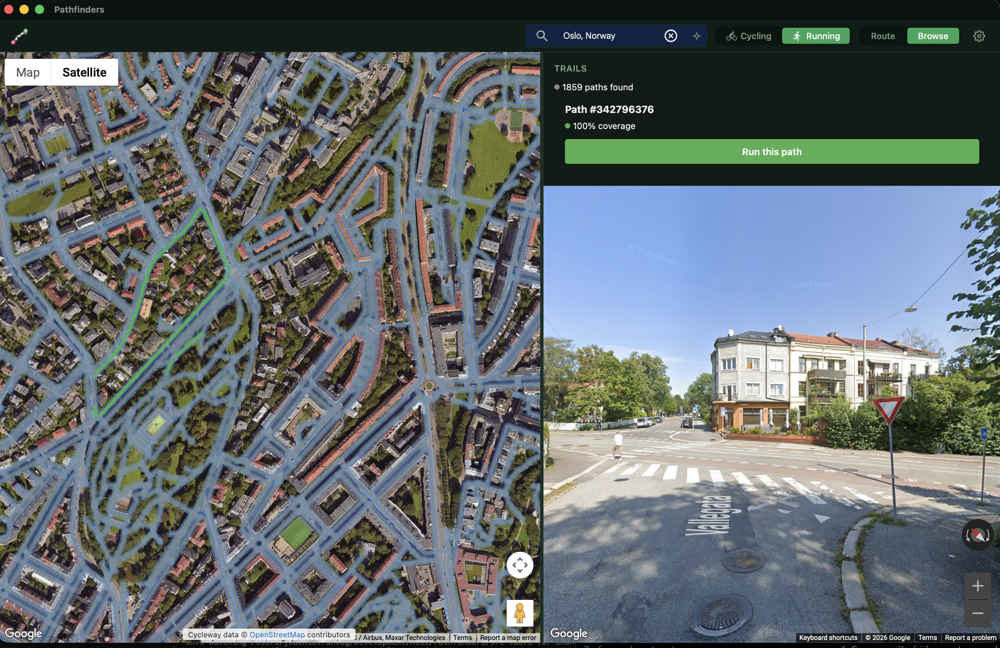
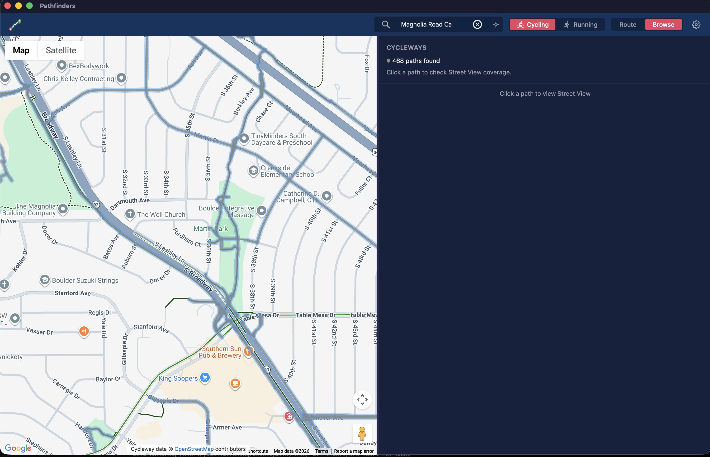
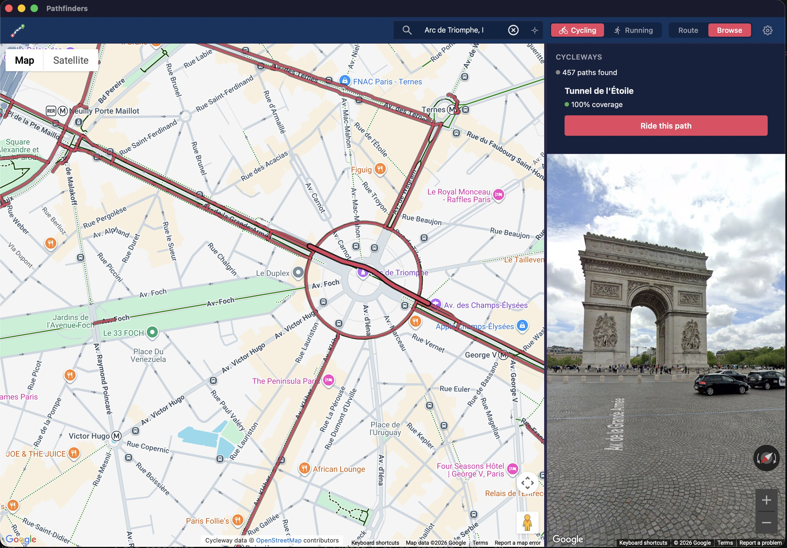
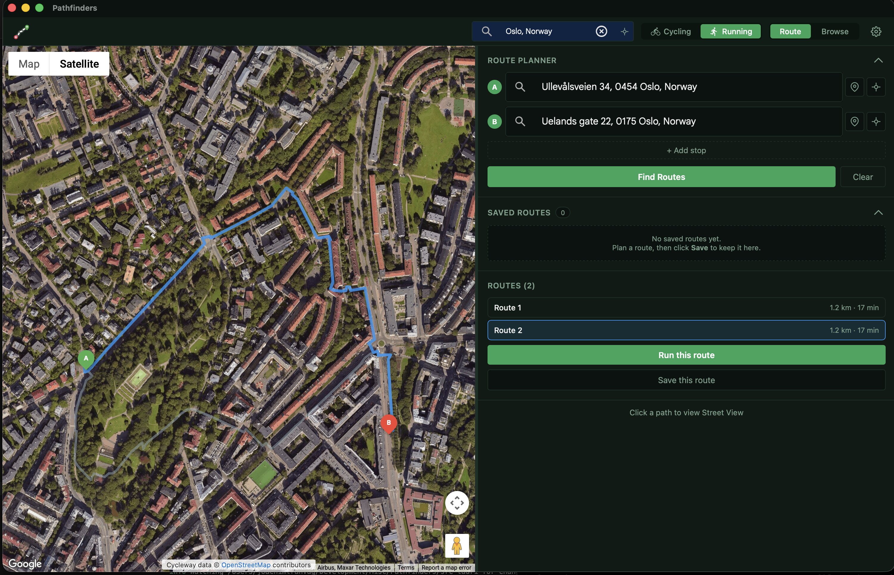
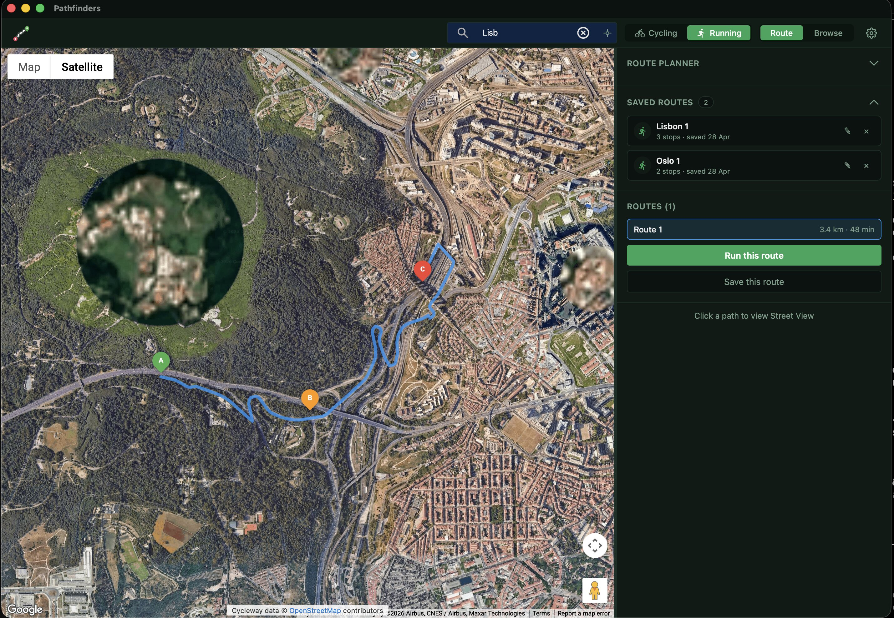
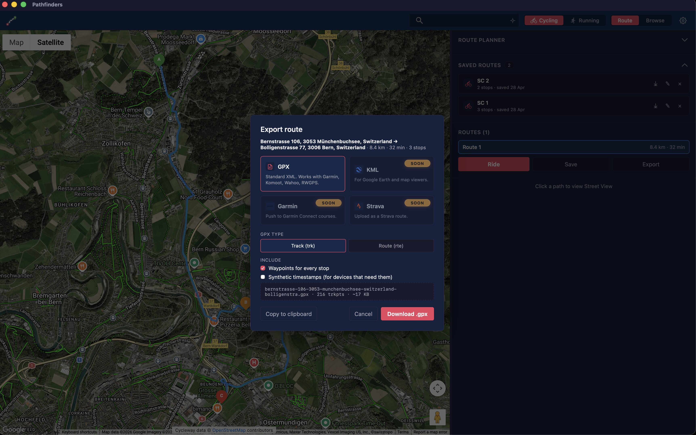
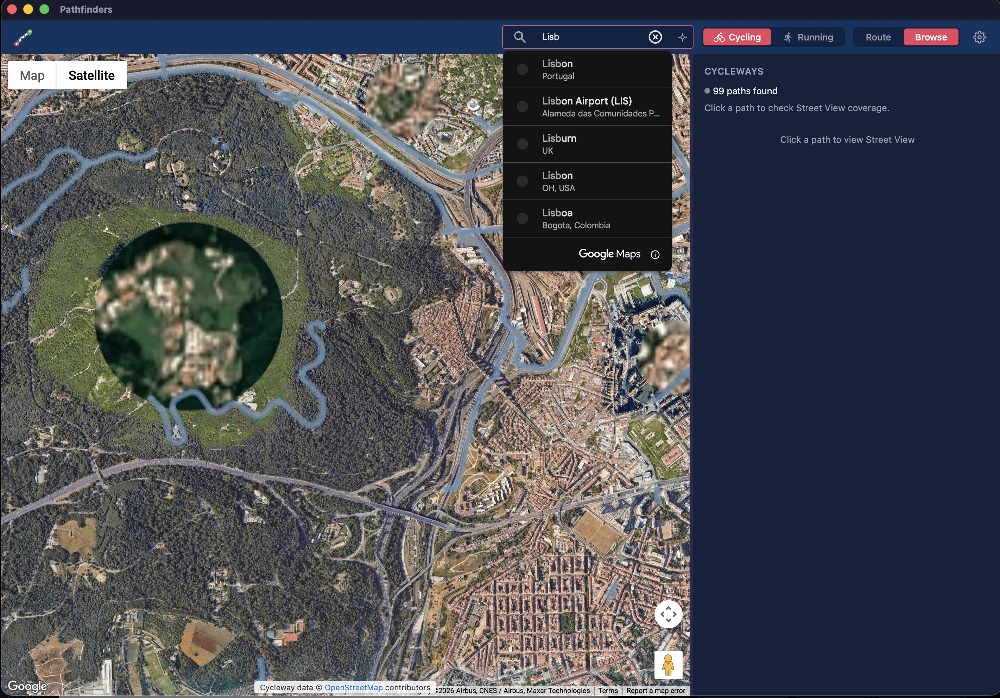
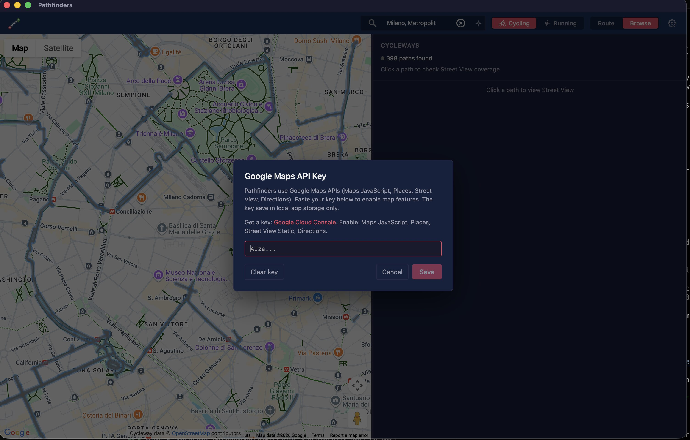

# Pathfinders

> Scout cycling and running routes from your desk — before you head out the door.

Pathfinders overlays OpenStreetMap's cycleway and footway network on top of Google Maps, tells you which segments have Street View coverage, and lets you "ride" or "run" any path frame-by-frame in Street View. Plan multi-stop trips, save them, and replay them later.

Built with **Tauri + React + TypeScript**. Runs as a native desktop app on macOS, Windows, and Linux, or as a web app for development.



---

## Why Pathfinders?

- **You want to know where the cycle paths actually are** — not just where Google says you can ride. OSM has the granular cycleway/footway data; Pathfinders surfaces it.
- **You want to see the route before you ride it** — every segment is one click away from Street View, and you can play any path back as a virtual ride.
- **You plan trips in stages** — multi-stop routing with saveable, reloadable trips, switchable between cycling and running.

## Features at a glance

| | |
|---|---|
| 🗺️ **Browse mode** | OSM cycleway/footway segments overlaid on the map, color-coded by Street View availability |
| 🚴 **Street View ride** | Animated playback of any segment or full route, sampled at fixed intervals with auto-computed heading |
| 📍 **Route mode** | Multi-stop Google Maps cycling/walking directions (up to 10 stops) with route alternatives |
| 💾 **Saved routes** | Name and revisit any planned trip; rename / delete / one-click reload |
| ⤓ **GPX export** | Export the active route or any saved route to a `.gpx` file (track or route variant), with optional waypoints and synthetic timestamps. Garmin Connect / Strava integrations on the roadmap. |
| 🖱️ **Map-click picking** | Click anywhere to set a stop; reverse-geocoded address fills the input automatically |
| 🔍 **Location search** | Google Places autocomplete in the header — jump to any city, address, or POI |
| 📡 **Use my location** | Native OS GPS prompt in the desktop app, browser geolocation in the web build |
| 🚴↔🏃 **Activity switcher** | Cycling vs running, with themed colors and activity-specific OSM queries |
| 🔑 **BYOK** | Bring your own Google Maps key — bake it into the build or paste it at runtime |
| 📜 **Attribution baked in** | OpenStreetMap credit always rendered on the map (ODbL compliance) |

---

## Showcase

### 🗺️ Browse mode — see the cycle network at a glance



Pan anywhere in the world. Pathfinders queries the OpenStreetMap Overpass API for all cycleways or footways in view, then checks which ones have Street View coverage. Color-coded segments show you instantly where you can — and can't — preview the route.

### 🚴 Street View ride — virtual scout before you ride



Click any segment in Browse mode and Pathfinders drops you into Street View at that point. Hit **▶** and the app samples points along the path at fixed intervals, snaps Street View to each one, and computes heading from the path geometry — you watch the route pass by like a low-frame-rate ride.

### 📍 Route mode — multi-stop planning



Switch to Route mode, drop in up to 10 stops (type, click on map, or "use my location"), and Pathfinders calls the Google Directions API with cycling or walking mode depending on activity. When you have just two stops, you get route alternatives to compare. The whole route is then playable in Street View.

### 💾 Saved routes — your scouted trips, one click away



Save any route by name. Reloading replays the original stops through the Directions API so the route stays current with up-to-date roads. Stored locally per-install — nothing leaves your machine.

### ⤓ Export — take your route to any device



Click **Export** in the active-route panel, or the ⤓ icon next to any saved route. Pathfinders opens a dialog with a format picker and writes a clean GPX 1.1 file you can hand to anything that speaks GPX — Garmin Connect, Komoot, Wahoo, Ride With GPS, plain old GPS receivers.

- **Track or Route** — pick `<trk>` (modern, accepted everywhere) or `<rte>` (older Garmin courses).
- **Waypoints for every stop** — each A/B/C marker becomes a named `<wpt>` so your device shows them on the map.
- **Synthetic timestamps** — generates monotonically increasing times along the polyline for devices that won't read a route without them.
- **Filename + size preview** — slugified from the route name, so `Münchenbuchsee → Bern` saves as `munchenbuchsee-bern.gpx`.
- **Native save sheet on desktop** — Tauri's dialog plugin (`@tauri-apps/plugin-dialog` + `@tauri-apps/plugin-fs`) opens a real macOS/Windows/Linux save sheet so you choose where the file lands. The web build falls back to a standard browser download.
- **Copy to clipboard** — for when you'd rather paste the XML somewhere directly.

KML export and direct push to **Strava** and **Garmin Connect** courses are on the roadmap (the format picker already shows them as "Soon" tiles).

### 🔍 Location search — jump anywhere



Google Places autocomplete in the header — type any city, address, or POI and the map flies there. The "Use my location" icon next to it triggers a native GPS prompt (Tauri plugin on desktop, browser geolocation on web).

---

## Setup

### Prerequisites

- Node.js 20+
- Rust toolchain (`rustup`) — only required for the Tauri desktop shell
- A Google Cloud project with these APIs enabled:
  - Maps JavaScript API
  - Places API (Autocomplete)
  - Street View Static API
  - Directions API

Get a key: https://developers.google.com/maps/documentation/javascript/get-api-key

> ⚠️ **Bring your own Google Maps API key.** Pathfinders does not ship with a key — every install must supply one. All API usage is billed to *your* Google Cloud account, so **set quota caps and key restrictions before publishing builds**.

### Install

```bash
npm install
```

### Providing the Google Maps API key

Two options:

**Option 1 — bake it into the build.** Copy `.env.example` to `.env` and fill in your key:

```bash
cp .env.example .env
# edit .env
```

The build will use this key directly and the in-app key dialog will not appear.

**Option 2 — paste it at runtime.** Skip the `.env` file. On first launch the app shows a dialog asking for your key. The key is stored in the app's local storage (per-user, per-install) and can be changed or cleared from the gear icon in the header.

If Google rejects the key (wrong restrictions, missing APIs), the app catches the auth failure, clears the stored user-supplied key, and reopens the dialog with an error.



## Running

### Web (development only)

```bash
npm run dev
```

Opens at http://localhost:5173. The browser handles the geolocation prompt natively.

### Desktop (Tauri)

```bash
npm run tauri:dev    # dev with HMR + devtools
npm run tauri:build  # production bundle in src-tauri/target/release/bundle
```

On macOS, the first time you trigger location it'll show the system permission prompt. If you deny it once, re-enable via *System Settings → Privacy & Security → Location Services → Pathfinders*.

## Architecture

For a tour of the codebase — layer responsibilities, store boundaries, and the data-flow diagrams for Browse mode, Route mode, and BYOK — see [`docs/ARCHITECTURE.md`](docs/ARCHITECTURE.md).

## Attribution

Cycleway and footway data from [OpenStreetMap](https://www.openstreetmap.org/), © OpenStreetMap contributors, licensed under the [Open Database License (ODbL)](https://opendatacommons.org/licenses/odbl/). The OSM credit is rendered on the map at all times.

Map tiles, Street View imagery, autocomplete, and routing from Google Maps Platform.

## License

Apache License 2.0 — see [LICENSE](./LICENSE) and [NOTICE](./NOTICE).
